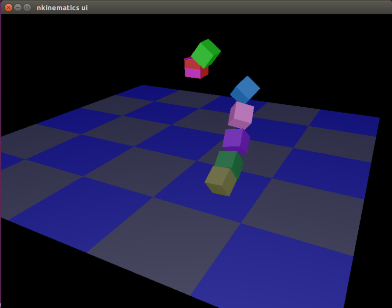

# k

Kinematics library using [nalgebra](http://nalgebra.org) for rust-lang.

See [Document](http://docs.rs/k) and examples/ for more details.

* [Document](http://docs.rs/k)

## Enjoy an IK example

```bash
cargo run --release --example interactive_ik
```




Push below keys to move the end of the manipulator.

- *f*: forward
- *b*: backward
- *p*: up
- *n*: down
- *l*: left
- *r*: right
- *z*: reset the manipulator state.
