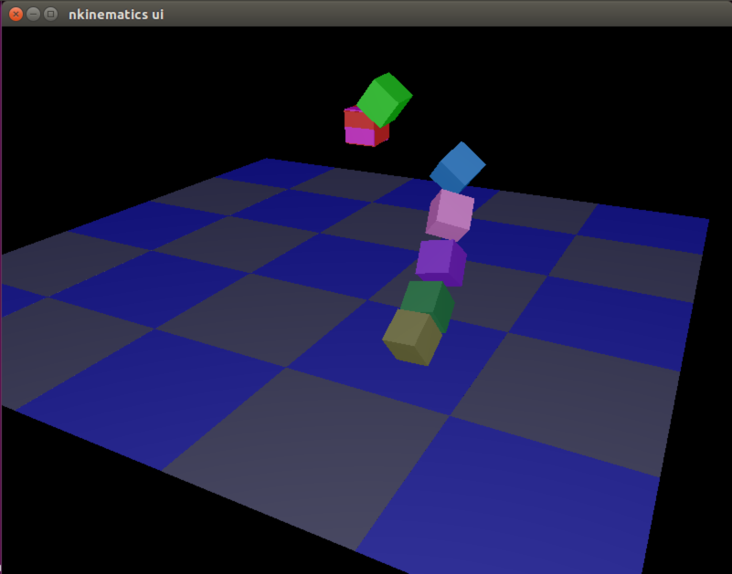

# nkinematics

Kinematics (forward/inverse) library using [nalgebra](http://nalgebra.org).

It uses RobotFrame structure to handle joints and links.
See examples/ for more details.

## Enjoy example at first!!



```bash
cd examples/
cargo run --bin interactive_ik
```

Push *f* *b* *p* *n* *l* *r* key to move the end of the manipulator.
*z* will reset the manipulator state.

## How to use
